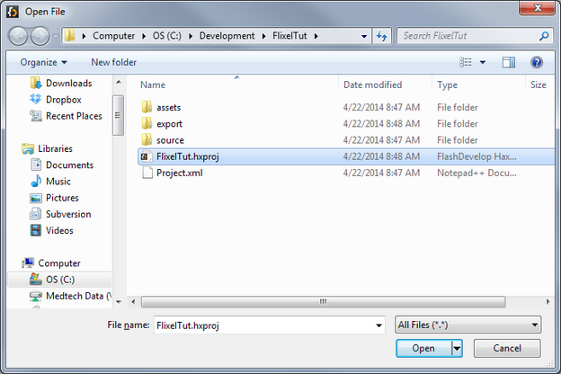
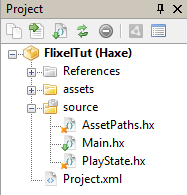
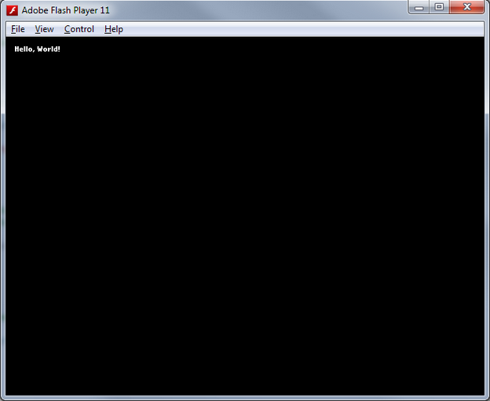

```
title: "2 - Creating a new project"
```

Now we want to make sure that everything is installed properly - and we want to set up the framework for our game. So we're going to make a new project, open it with FlashDevelop and test that it builds and runs.

1. In the command prompt, enter:

	```bash
	flixel tpl -n "FlixelTut"
	```
	This will create a new Flixel project using the blank template in the directory `FlixelTut` (as well as naming the project `FlixelTut`).
	
2. Outside of the Command Prompt, launch FlashDevelop. Select `File > Open` and browse to where your `FlixelTut` directory was created. It should look something like this:

	

3. Open the `FlixelTut.hxproj` file.

4. Over on the right side of the screen, you should see your project. This will contain all the files that the template generated for us.

	

5. Next, let's make sure that our project builds and runs properly. By default, a fresh, new Flixel template project will launch the game in the `PlayState`. So go ahead and double-click to open that file from the project list.
	This file is a very basic (and empty) example of a `FlxState` subclass. You can think of `FlxState`s a little bit like 'scenes'. When your game is running, one - and only one - state will be the active state. Anything 'added' to that state will be visible and accessible by the player, and, for the most part, will be segregated from other states in your game.

	They are great for having different sections of your game that are sort of in a bubble from one another, such as the `MenuState` and the `PlayState` (where the game is actually played).

	You'll see that, at least for now, the `PlayState` only has two functions in it: `create()` and `update()`. When a state is loaded, its `create()` function is called. This is where you want to initialize all of the things in your state.

	`update()` is where all the real magic happens - it is called every 'frame' in your game (by default 60 times per second). When a `FlxState`'s `update()` is called, it will call `update()` on all of the objects that have been added to it. This is basically how everything in your game actually 'happens'. We will get to play with this more later on.
	For now, we JUST want to see that the whole thing works, so, we're going to add a simple `FlxText` object to this state.

6. In `create()`, right before the line that says `super.create();`, add a new line and type the following:

	```haxe
	add(new FlxText(10, 10, 100, "Hello, World!"));
	```
	Then save your changes.

7. The Moment of Truth! Go up to the toolbar in FlashDevelop and choose 'Debug' and 'Flash':

	

	Then, press the blue arrow next to 'Debug' (or hit `F5`) and you should see:
	
	

	It worked! You've built and ran your first HaxeFlixel project!

	At this point, you could try building it for Neko, Windows and Android to make sure they all work as well. If you run into problems with any of those, double-check your code, check out the OpenFL installation information, and if that doesn't help, let us know on the forums.

	This is only a small step towards bigger and better things! In the next part, we'll actually define the game we're going to be building, and start putting it together!
