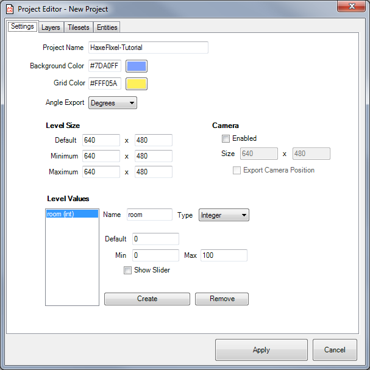
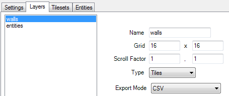
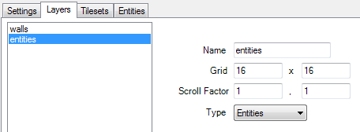
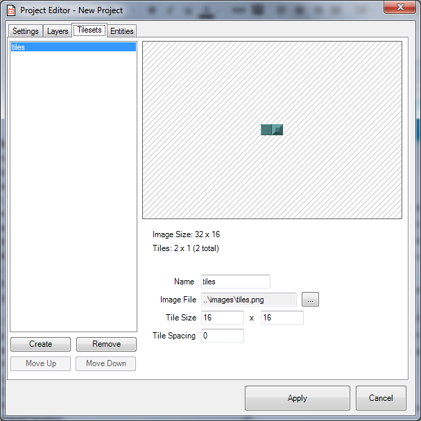
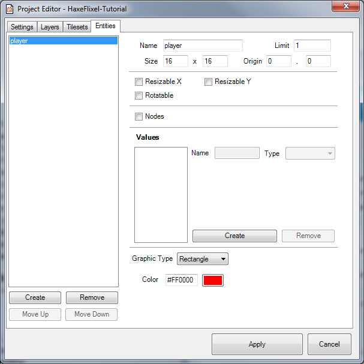
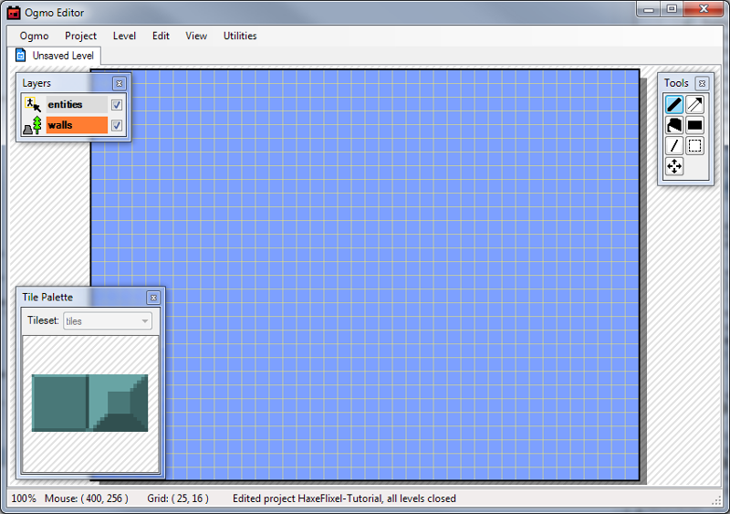
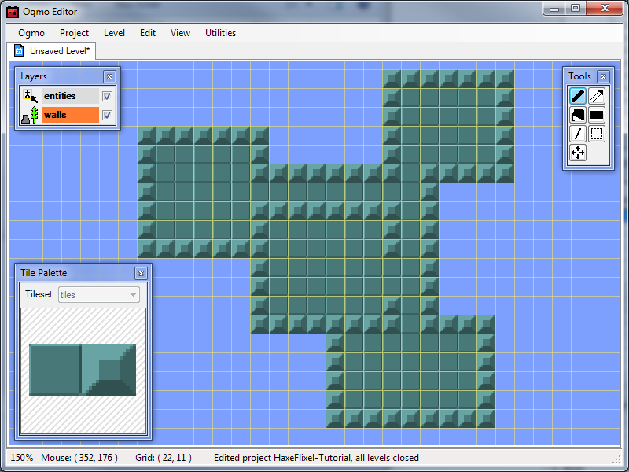
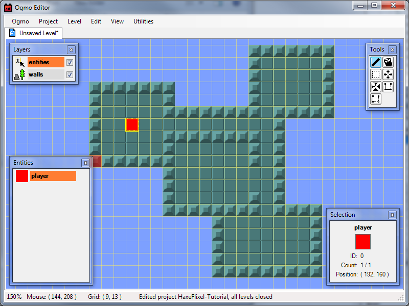

```
title: "5 - Creating a Tilemap"
```

Now it's time to make some maps for the player to move around in! To do this, we're going to use a tool called _Ogmo Editor_. Ogmo is a free tilemap editor that works very nicely with HaxeFlixel. For this part of the tutorial, we're just going to use a simple 2-tile tilesheet with a tile for walls and a tile for floors.

You can make your own, with 16x16 pixel tiles, or use this one:


(Note: the first tile should be empty!)

1. Go to [http://www.ogmoeditor.com](http://www.ogmoeditor.com/) to download and install it, then launch the editor.

	Note: Ogmo is Windows-only, if you are using something else (or, if you just want to), you can try using [Tiled](http://www.mapeditor.org/), another free, but slightly more complex tool.

2. Go to `Project > New Project` and name your project whatever you want. Save it in `assets/data`.

3. Next, you need to define your project's settings. Go through each tab, one-by-one, and set it up to look like the following:

	

	

	

	

	

4. Hit Apply to save your changes. You should now see a screen that looks like this:
	
	

5. Make sure you're on the 'walls' layer, and, using tools on the right, draw out a simple map. Make sure it's completely encircled by walls (so the player can't wander off the map), and make the insides filled with floor tiles. You should end up with something like this:
	
	

6. Now, switch over to the 'entities' layer, and place your player entity somewhere in one of your rooms:
	
	

7. Go up to `Level > Save Level`, and save this as `room-001.oel` in `assets/data`.

8. We're done with Ogmo for now, so save all your changes and exit.

In the next part, we will learn how to load the newly created tilemap into our game.
