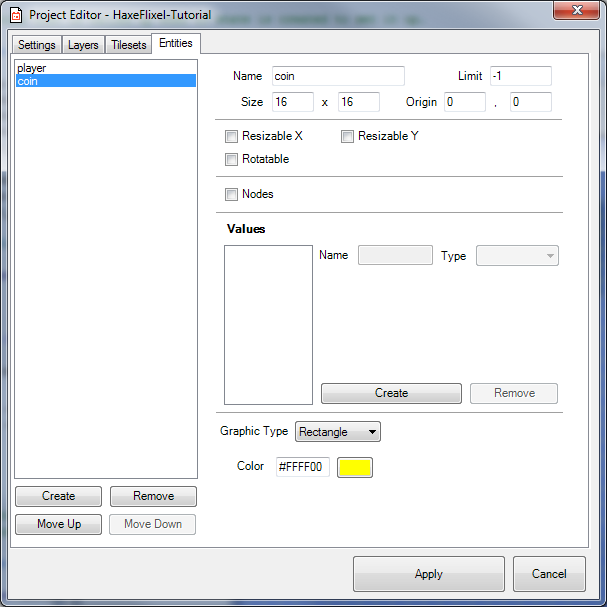
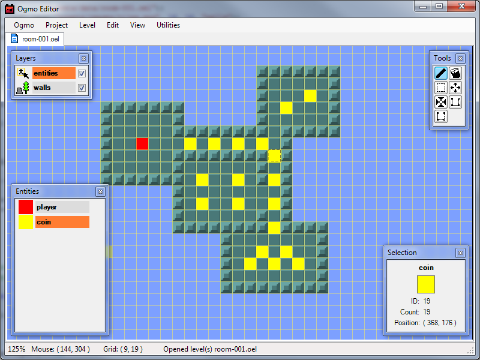
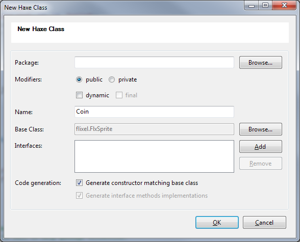
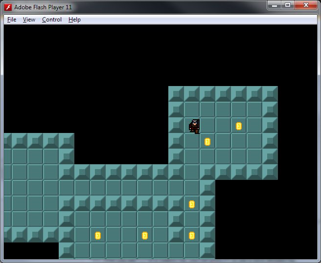

```
title: "7 - Pickups"
```

Now that we have our little guy running around our map, lets give him something to pickup. We'll add some simple coins that will add to the player's score when they are picked up.

1. Open up your project in Ogmo again, and go to Project > Edit Project.

2. On the Entities tab, add a new entity:
		
	

3. Open up the level we used before, and, on the 'entities' layer, scatter a bunch of coins around:

	

4. We're going to make our coins be 8x8 pixels. For the coin's graphic, you can use this image , or make your own. Make sure you save this in "assets/images".

5. Get back into FlashDevelop, and make a new class:

	

6. For now, our coin is going to be really simple. Just change the constructor to look like this:

	```haxe
	public function new(X:Float=0, Y:Float=0) 
	{
		super(X, Y);
		loadGraphic(AssetPaths.coin__png, false, 8, 8);
	}
	```

7. Now, head back to the PlayState. We need to change our map logic so that when it is loading the entities, when it sees a coin in our Ogmo file, it will add a coin to our state.

8. First, let's make a FlxGroup to hold all the coins in. In the top of our class, where we defined all our variables so far, add:
	
	```haxe
	private var _grpCoins:FlxTypedGroup<Coin>;
	```
	
	FlxGroups are like arrays of Flixel Objects which can be used in a lot of different ways. In this case, since our group will only be containing coins, we will make it a FlxTypedGroup.

	In the create function, after we add our walls, and before we initialize our player, we need to initialize and add our Coin group:

	```haxe
	_grpCoins = new FlxTypedGroup<Coin>();
	add(_grpCoins);
	```

9. Next, we just want to change our `placeEntities` function to put a coin into our group every time it encounters one in our Ogmo file. At the end of our if statement, add:

	```haxe
	else if (entityName == "coin")
	{
		_grpCoins.add(new Coin(x + 4, y + 4));
	}
	```
	
	This will simply create a new coin, tell it to be at the position defined in the Ogmo file (+4 x and y to center it on the tile), and add it to the Coin group.

10. Now we need to have the player be able to collect the coins. We're going to use an overlap check to do this. In update, after your `FlxG.collide` call, add:

	```haxe
	FlxG.overlap(_player, _grpCoins, playerTouchCoin);
	```

	This just says: every update, check if there are any overlaps between the player and the coin group, and if there are, call `playerTouchCoin`.

11. Let's add the `playerTouchCoin` callback now:

	```haxe
	private function playerTouchCoin(P:Player, C:Coin):Void
	{
		if (P.alive && P.exists && C.alive && C.exists)
		{
			C.kill();
		}
	}
	```

	This function simply verifies that the player and the coin that overlap each other are both alive and exist, and if so, kill the coin (we'll add the score a little later on).

	If you run the game right now, as you walk around the map, each coin you touch will disappear. Works great, but it's a little boring… Let's add a little style!

12. Go back to your Coin class, and add these functions:

	```haxe
	override public function kill():Void
	{
		alive = false;
		FlxTween.tween(this, { alpha:0, y:y - 16 }, .33, { ease:FlxEase.circOut, complete:finishKill } );
	}
	
	private function finishKill(_):Void
	{
		exists = false;
	}
	```

	First, we override the kill function - normally, by calling kill on an object, it will set both the alive and exists properties to false. In this case, we want to make alive as false, but we don't want to make exists false just yet (objects with exists = false do not get drawn on the screen). Instead, we initialize a FlxTween.

	FlxTween is a powerful tool that lets you animate an object's properties. For our coins, we want to make it fade out while also rising up.

	We set the duration to .33 seconds, and we are using the `circOut` easing style, to make the tween look a little nicer. Also we want to call `finishKill()` when the tween has completed, which just sets the coin's `exists` property to false, removing it from the screen. By default, the tween type is set to `ONESHOT` so it is only executed once (instead of looping). You can change this by specifying a different `type` in the tween options, but in our case the default behavior is just what we need. 
	
	The type of the `FlxTween` complete callback is `FlxTween->Void` (receives a single `FlxTween` parameter and returns nothing). In this case, we named it `_` to indicate that we don't care about it, which is a common Haxe idiom (other than that, there's nothing special about it - to the compiler it's just a parameter named `_`).

Try out the game now, and you'll notice the difference when you pick up coins! We'll do some more of this later on when we start adding 'juice' to our game.



In the next part, we'll talk about enemies!
